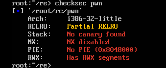
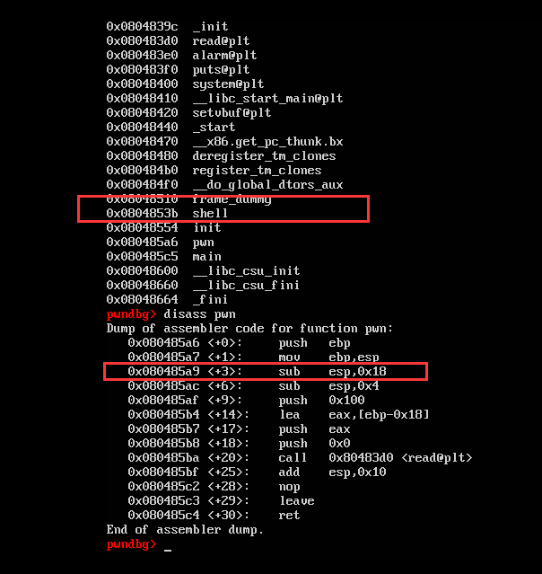

# 赛题设计说明

## 题目信息：

* 题目名称：library
* 预估难度：中等偏易 （简单/中等偏易/中等偏难/困难）
* 编译命令：gcc library.c -fstack-protector-all -z now -s -no-pie -O1 -o library 

## 题目描述：

> 这是一个很简单的pwn哦，相信你一定能通过自己的聪明才智获得服务器中的 flag。

## 题目考点：

1. 逆向算法
2. UAF
3. unlink


## 思路简述：
首先可以分析出，这个初始随机值经过4次乘法后最多为40位，而输出的只是后32位，因此先爆破头八位，然后将整个40位的数除以能够整除的值。如果这个40位的数是正确的，那么它经过4次除法后，其结果将落在初始随机数的范围内。

后利用UAF构造伪small chunk再将其释放产生unlink操作改写堆指针，进一步实现任意地址读写，写__free_hook控制获得system


## 题目提示：
1. 爆破
2. UAF
3. unlink


## 原始 flag 及更新命令：

```shell
    # 原始 flag
    flag{icq_test}
    # ..
    # 更新 flag 命令
    echo 'flag{b55ef6bc-fbb6-8381-93f3-c073b77f6c78}' > /flag
```

## 题目环境：

1. Ubuntu 16.04 LTS
2. xinetd + chroot

## 题目制作过程：

1. 编写 library.c 代码，详细代码请从 “源码” 文件夹获取，
2. 编译方式在源代码第一行，
3. 编写 xinetd 配置文件，设置好参数，
4. 按官网的提示删除了Dockerfile里第7到第16行


## 题目 writeup：

1. 密码验证部分

   ```python
   def cal(cipher):
   key=[61, 73, 83, 97, 109, 113, 127, 131, 137, 139, 149, 151, 167, 179, 193, 199, 211, 223, 229]
   for i in range(0xa8):
   	ciphermid=cipher+(i<<32)
   	for j in range(4):
   		for k in key:
   			if ciphermid % k == 0:
   				ciphermid=ciphermid//k
   				break
   	if ciphermid in range(64,263):
   		cipher=ciphermid
   		break
   return cipher
   ```

   

2. pwn部分

1. 检查题目保护，除了PIE，其他保护均打开

  




2. 使用IDA分析函数，发现在free掉堆后没有对指针清零，存在UAF漏洞





3. 编写exp.py，先申请7个0x20大小的堆，连续释放两个，这两个会形成fastbin的单向链表，通过UAF漏洞泄露出堆地址


4.在堆中伪造一个small chunk并将其释放，触发unlink操作，修改指向chunk的指针


5.已经可以控制任意地址读写，先修改edit限制，然后读GOT表，将system的地址填入__free_hook地址中，然后释放内容为“/bin/sh\x00”的堆，就获得了shell


## 注意事项

1. 题目名称不要有特殊符号，可用下划线代替空格；
2. 根据设计的赛题，自行完善所有文件夹中的信息；
3. 此文件夹下信息未完善的队伍，将扣除一定得分。